## MentorSphere is an online platform that connects mentors and mentees around the world for free

## Tech Stack
- React Js
- Node Js
- Express Js
- MongoDB
- Redux
- ShadCn for UI
- JWT for Authentication
- Bcrypt for Password Encryption
- Typescript
- zod for validations
- Nodemailer for Sending Verfication Emails

## Features
- User can register as a mentor or mentee
- User can search for mentors based on their skills
- User can book a connect with a mentor or a mentee
- User can see their connections
- User can receive notifications
- User can search for others on the basis of their prefrence
- Pagination applied when searching for mentors or mentees
- Validations are applied for correct inputs

[Live Link](https://mentor-ship-frontend.vercel.app/)
You can use email as `rahul24012006@gmail.com` and password as `rahulGupta2401@` for login directly or create your own account

## Setup Guide

#### Server Setup
(Make sure [nodejs](https://nodejs.org/en/download/package-manager) is installed on your computer)

1. Open the terminal in `backend`folder and run `npm install`

2. Create a new `.env` file in server folder and add the environment variables as mentioned in `.env.sample` file

3. Run `npm run build` to create dist folder

4. Run `npm run dev` to start the server

#### Frontend Setup

1. Open terminal `client` folder and run `npm install`

2.  Create a new `.env` file in client folder and add the environment variables as mentioned in `.env.sample` file

3. Run `npm run dev` to start the frontend

## Home, Login and Registration Page
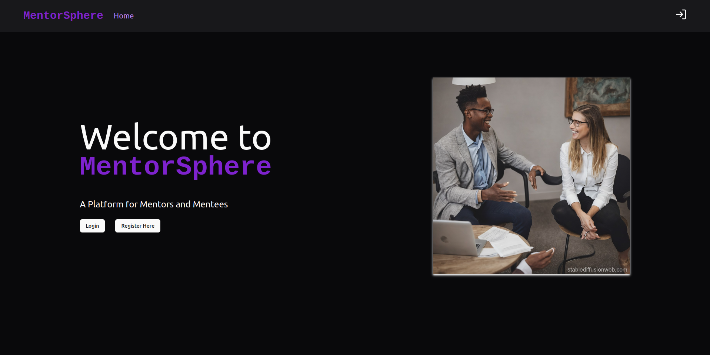
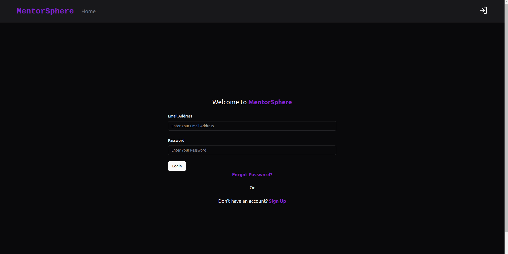
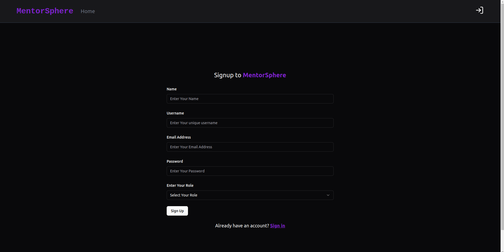

#### Profile Page
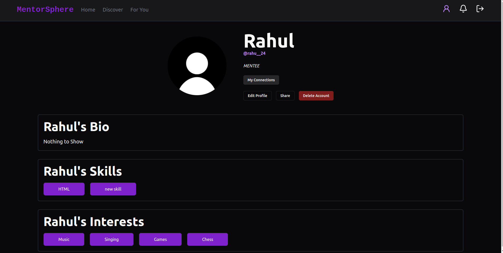
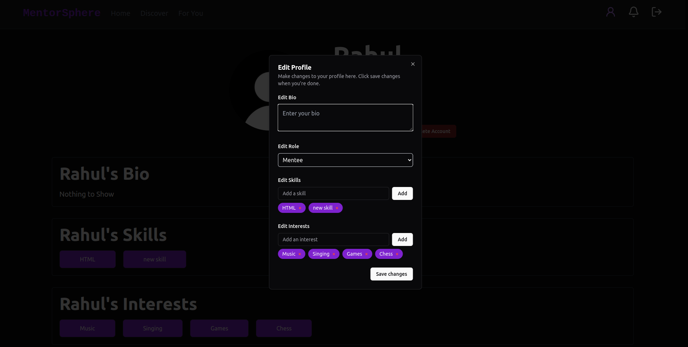
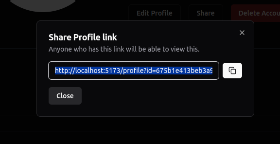
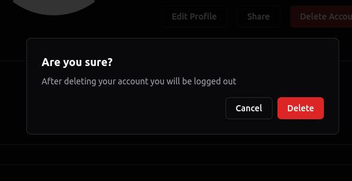
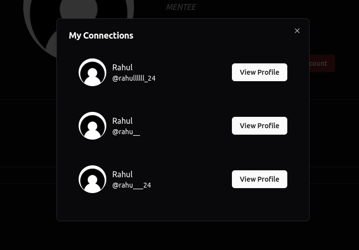
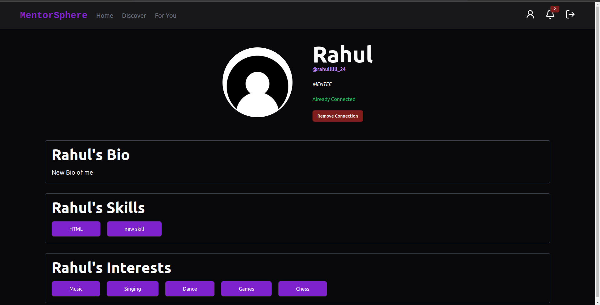

#### Discover Page
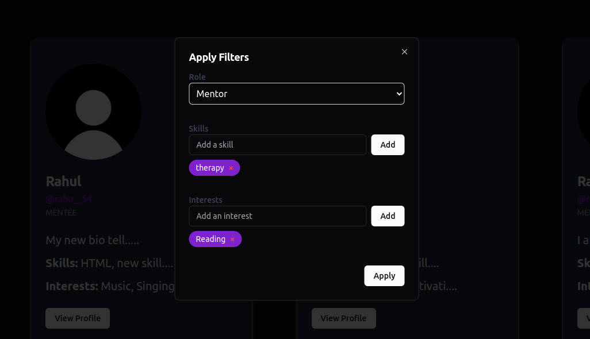
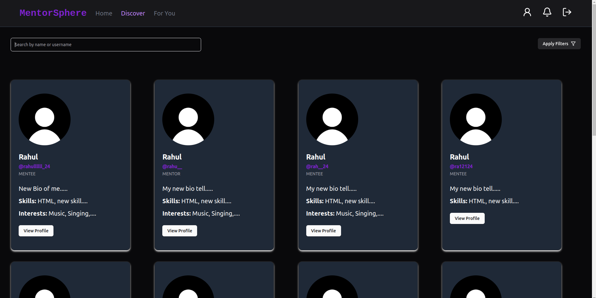
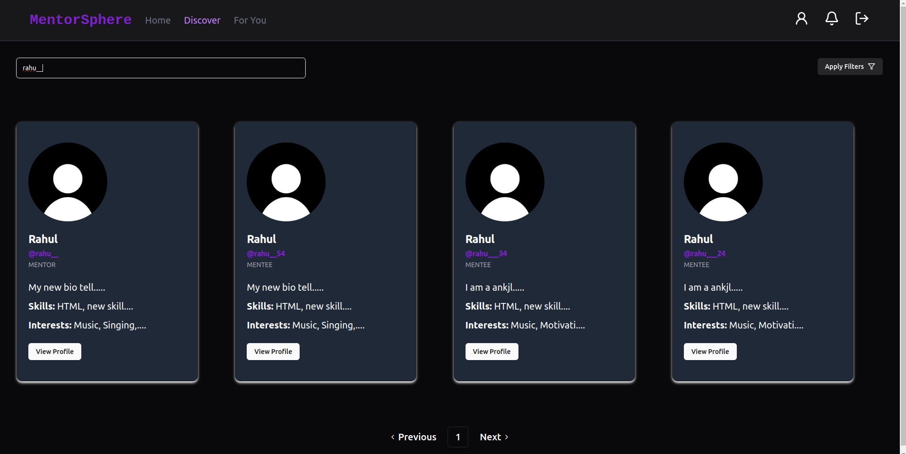

#### For You Page
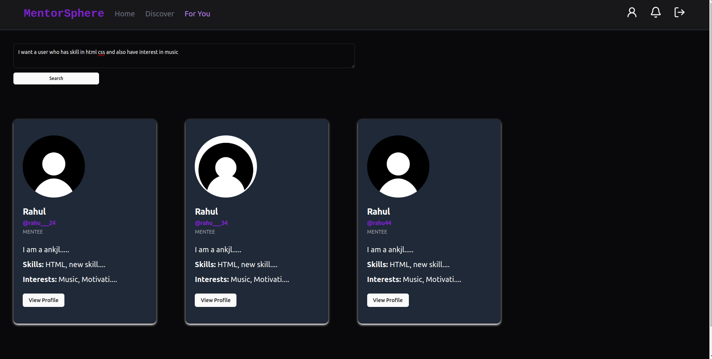

## Author's Social Links 🖥️

- [Twitter](https://twitter.com/rahu__24)
- [LinkedIn](https://www.linkedin.com/in/rahu24/)
- [Instagram](https://www.instagram.com/rahu__24/)